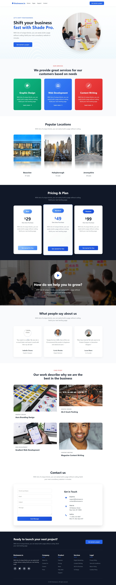

# Brainwave.io - Business Landing Page

    

## 📸 Preview

  

A modern, professional landing page for business consultancy services. Fully responsive design with interactive elements.

## 🚀 Quick Start

1. **Download** this repository
2. **Open** `index.html` in any modern browser
3. **That's it!** No build process or dependencies needed

## ✨ Features

- ✅ **Fully Responsive** - Works on mobile, tablet & desktop
- ✅ **Modern Design** - Clean layout with gradient accents
- ✅ **Interactive Elements** - Hover effects & animations
- ✅ **Mobile Navigation** - Hamburger menu for small screens
- ✅ **Contact Form** - With contact information section
- ✅ **Fast Loading** - Optimized performance
- ✅ **Cross-browser Compatible** - Works on all modern browsers

## 🎨 Sections Included

1. **Header** - Fixed navigation with responsive menu
2. **Hero** - Eye-catching hero section with circular image
3. **Services** - Three service cards with gradient backgrounds
4. **Locations** - Location showcase with image reflections
5. **Pricing** - Three-tier pricing plans
6. **Video Section** - Full-width video background
7. **Testimonials** - Customer reviews
8. **Case Studies** - Portfolio showcase
9. **Contact** - Form + contact information
10. **Footer** - Multi-column footer with links

## 🛠️ Technologies

- **HTML5** - Semantic markup
- **CSS3** - Flexbox, Grid, Animations, CSS Variables
- **JavaScript** - Interactive functionality
- **Font Awesome** - Icons

## 📱 Responsive Breakpoints

- **Mobile**: < 768px (Single column layout)
- **Tablet**: 768px - 1024px (Adaptive layouts)
- **Desktop**: > 1024px (Full multi-column)

## 🙋‍♂️ Support

**Report issues**: Open a GitHub issue  
**Questions**: Check the code comments  
**Customizations**: Edit the CSS/HTML directly

⭐ Star this repo if you found it useful!
